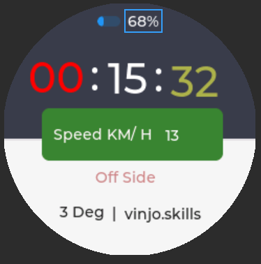

# Smart Bat Project

The Smart Bat project aims to develop an IoT-enabled device that attaches to a cricket bat handle to analyze and improve player technique. By integrating sensors and microcontrollers, the Smart Bat provides real-time feedback on various aspects of batting performance, helping players enhance their skills and performance on the pitch.

## Features

The Smart Bat device offers the following features:

1. **Time Spent on Pitch:** Analyze the duration a player spends on the pitch during their batting session.
2. **Swing Speed:** Measure the speed at which the bat swings during the batting action.
3. **Timing Efficiency:** Evaluate the timing accuracy of the player's batting strokes.
4. **Bat Lift Angle:** Measure the angle at which the bat is lifted during the backswing.
5. **Wagon Wheel:** Visualize the distribution of shots played across different areas of the cricket field.
6. **Rotation at Impact:** Analyze the rotation of the bat at the moment of impact with the ball.

## Hardware Components

To implement the Smart Bat project, the following hardware components are utilized:

- Waveshare RP2040 MCU Board: The main microcontroller unit for processing sensor data and controlling the device's operations.
- Sensors QMI8658 :
  - Accelerometer: Detects bat motion and swing speed.
  - Gyroscope: Measures bat rotation and angular velocity.
- Display: Waveshare 1.28-inch Round LCD for visualizing real-time data and feedback.
- Bluetooth Module: Enables wireless communication with mobile devices for dat
